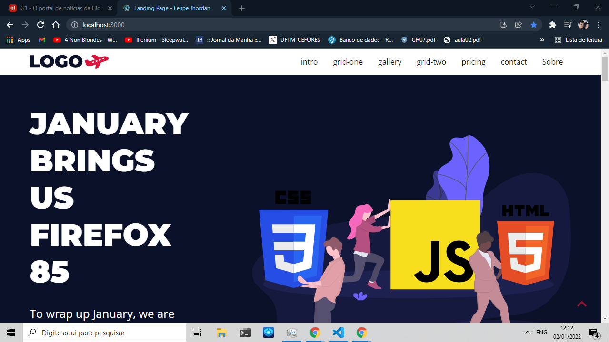
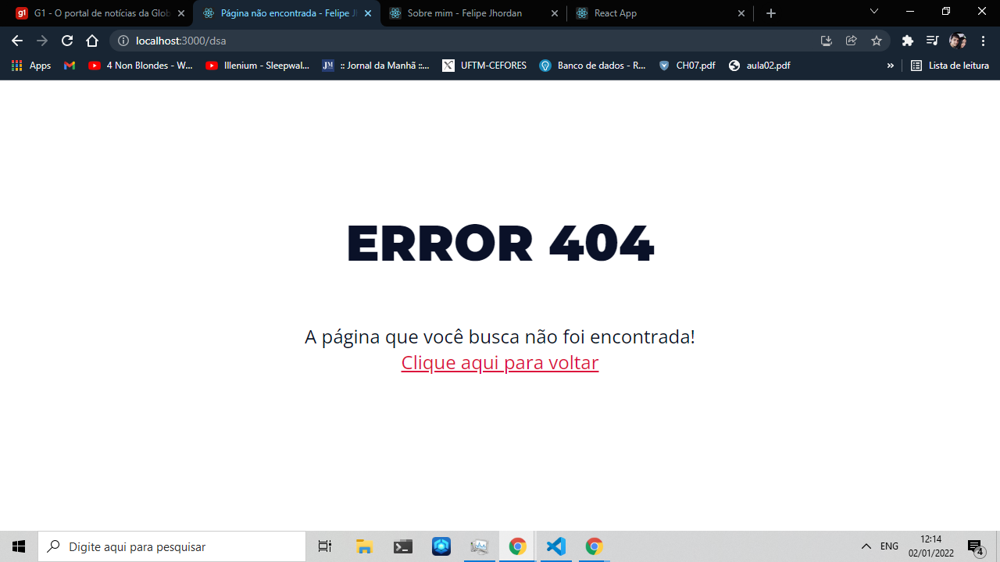
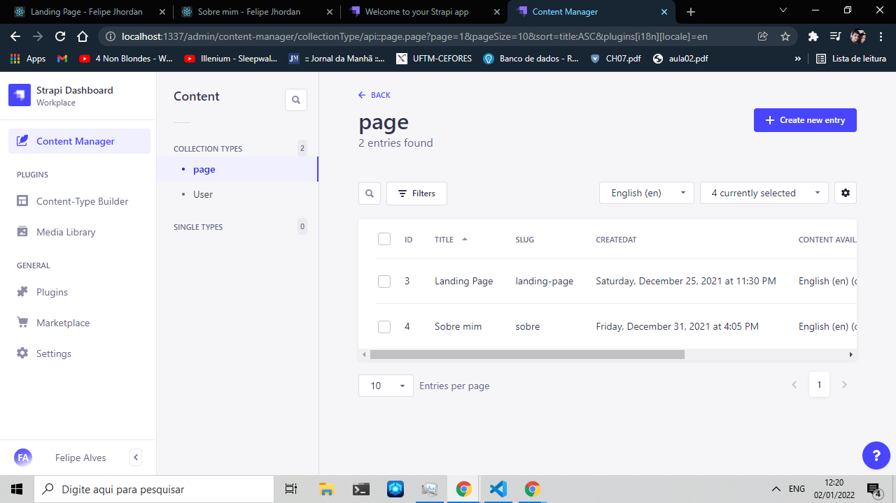

# Landing page gerador   

## Sumário
<!--ts-->
   * [Motivacão](#motivacão)
   * [Processo](#processo)
   * [Site](#site)
   * [Instalação](#instalacão)
   * [Como Executar](#como-executar)
   * [Tecnologias](#tecnologias)
   * [Imagens](#imagens)
<!--te-->

## Motivacão
Aprimorar o conhecimento de react, especificamente utilizando jest e styled components
## Processo
Primeiramente foi criado a camada de serviços, utilizando docker com um container utilizando uma imagem de postgresql.
No front o fluxo de criação foi feita na ordem de criação do component/visualização unitária pelo storybook, teste unitário utilizando o jest e após a criação de todos os components ecessários foram acoplados em um template.
## Site
Os commits foram feitos de forma semantica, utilizando um titulo haver com o propósito do commit
https://naughty-brahmagupta-32d8ac.netlify.app/ ( Pode demorar 20 segundos - 30 segundos pra ser carregado devido ao plano free )
## Instalacão
### Para rodar o projeto é necessário:
 - Node v12+
 - Git ( Para clonar )
 - Postgree || Docker
 ### Para instalar é necessário executar os seguintes comanandos: 
 - git clone https://github.com/FelipeJhordan/landing_page.git
 - cd frontend
 - npm install
 - cd  ../backend
 - npm install
## Como Executar
Para executar a camada de frontend é necessário aplicar o comando "npm run start".
Para executar a camada de backend é necessário aplicar o comando "npm run develop".
## Tecnologias
### Frontend
- ReactJS
- StyledComponents
- Storybook
- Jest
- React Modal
### Backend
- Strapi ( com postgresql )
### Implantação
Foi utilizado a plataforma de hospedagem Netlify para o frontend.
O backend não foi colocado no ar, porém a utilização do frontend é possível devido a um mock de dados de 2 páginas.
## Imagens

<h4> Frontend </h4>

 
 
 
 

<h4> Strapi </h4>

 

 

